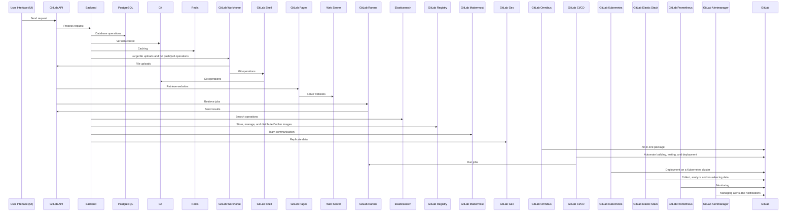

# programming-notes

- Gitlab Sequence Diagram

```mermaid
sequenceDiagram
    participant User Interface (UI)
    participant GitLab API
    participant Backend
    participant PostgreSQL
    participant Git
    participant Redis
    participant GitLab Workhorse
    participant GitLab Shell
    participant GitLab Pages
    participant Web Server
    participant GitLab Runner
    participant Elasticsearch
    participant GitLab Registry
    participant GitLab Mattermost
    participant GitLab Geo
    participant GitLab Omnibus
    participant GitLab CI/CD
    participant GitLab Kubernetes
    participant GitLab Elastic Stack
    participant GitLab Prometheus
    participant GitLab Alertmanager
    User Interface (UI) ->> GitLab API: Send request
    GitLab API ->> Backend: Process request
    Backend ->> PostgreSQL: Database operations
    Backend ->> Git: Version control
    Backend ->> Redis: Caching
    Backend ->> GitLab Workhorse: Large file uploads and Git push/pull operations
    GitLab Workhorse ->> GitLab API: File uploads
    GitLab Workhorse ->> GitLab Shell: Git operations
    GitLab Shell ->> Git: Git operations
    GitLab API ->> GitLab Pages: Retrieve websites
    GitLab Pages ->> Web Server: Serve websites
    GitLab API ->> GitLab Runner: Retrieve jobs
    GitLab Runner ->> GitLab API: Send results
    Backend ->> Elasticsearch: Search operations
    Backend ->> GitLab Registry: Store, manage, and distribute Docker images
    Backend ->> GitLab Mattermost: Team communication
    Backend ->> GitLab Geo: Replicate data
    GitLab Omnibus ->> GitLab: All-in-one package
    GitLab CI/CD ->> GitLab: Automate building, testing, and deployment
    GitLab CI/CD ->> GitLab Runner: Run jobs
    GitLab Kubernetes ->> GitLab: Deployment on a Kubernetes cluster
    GitLab Elastic Stack ->> GitLab: Collect, analyze and visualize log data
    GitLab Prometheus ->> GitLab: Monitoring
    GitLab Alertmanager ->> GitLab: Managing alerts and notifications
```
