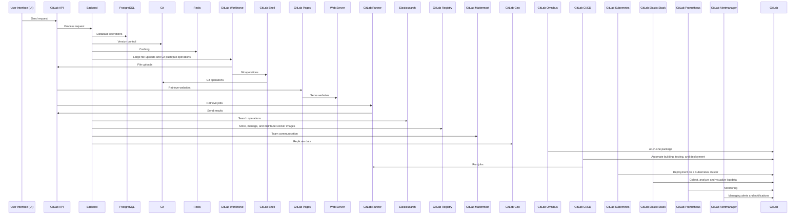
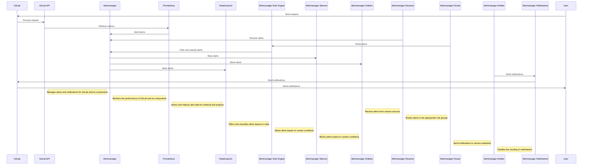

# programming-notes

- Major Component Interaction Gitlab

```mermaid
graph TD

Core --> API
Core --> WebUI
Core --> Database
Core --> Repositories
Core --> Issues
Core --> MergeRequests
Core --> Wikis
Core --> Users
Core --> Groups
Core --> Notifications
Core --> Authentication
Core --> Authorization
Core --> Backup
Core --> Audit
Core --> Performance
Core --> Addons
Core --> ExternalIntegrations

API --> Core
WebUI --> API
Database --> Core
Repositories --> Core
Repositories --> Issues
Repositories --> MergeRequests
Repositories --> Wikis
Repositories --> Notifications
Issues --> Core
Issues --> Repositories
Issues --> MergeRequests
Issues --> Wikis
Issues --> Notifications
MergeRequests --> Core
MergeRequests --> Repositories
MergeRequests --> Issues
MergeRequests --> Wikis
MergeRequests --> Notifications
Wikis --> Core
Wikis --> Repositories
Wikis --> Issues
Wikis --> MergeRequests
Wikis --> Notifications
Users --> Core
Users --> Authentication
Users --> Authorization
Users --> Notifications
Groups --> Core
Groups --> Users
Groups --> Authentication
Groups --> Authorization
Groups --> Notifications
Notifications --> Core
Notifications --> Repositories
Notifications --> Issues
Notifications --> MergeRequests
Notifications --> Wikis
Notifications --> Users
Notifications --> Groups
Authentication --> Core
Authentication --> Users
Authentication --> Groups
Authorization --> Core
Authorization --> Users
Authorization --> Groups
Backup --> Core
Audit --> Core
Performance --> Core
Addons --> Core
Addons --> CI/CDRunner
Addons --> KubernetesIntegration
Addons --> GitLabPages
Addons --> GitLabRegistry
Addons --> GitLabRunner
Addons --> GitLabMonitoring
Addons --> GitLabLogging
Addons --> GitLabCI/CD
Addons --> GitLabDevOps
Addons --> GitLabSecurity
ExternalIntegrations --> Core
ExternalIntegrations --> GitHub
ExternalIntegrations --> Jira
ExternalIntegrations --> Slack
ExternalIntegrations --> LDAP
ExternalIntegrations --> SAML
ExternalIntegrations --> MicrosoftTeams
ExternalIntegrations --> GoogleCalendar
ExternalIntegrations --> Trello
ExternalIntegrations --> Bitbucket
ExternalIntegrations --> Asana
```

- Gitlab Sequence Diagram

```mermaid
sequenceDiagram
    participant User Interface (UI)
    participant GitLab API
    participant Backend
    participant PostgreSQL
    participant Git
    participant Redis
    participant GitLab Workhorse
    participant GitLab Shell
    participant GitLab Pages
    participant Web Server
    participant GitLab Runner
    participant Elasticsearch
    participant GitLab Registry
    participant GitLab Mattermost
    participant GitLab Geo
    participant GitLab Omnibus
    participant GitLab CI/CD
    participant GitLab Kubernetes
    participant GitLab Elastic Stack
    participant GitLab Prometheus
    participant GitLab Alertmanager
    User Interface (UI) ->> GitLab API: Send request
    GitLab API ->> Backend: Process request
    Backend ->> PostgreSQL: Database operations
    Backend ->> Git: Version control
    Backend ->> Redis: Caching
    Backend ->> GitLab Workhorse: Large file uploads and Git push/pull operations
    GitLab Workhorse ->> GitLab API: File uploads
    GitLab Workhorse ->> GitLab Shell: Git operations
    GitLab Shell ->> Git: Git operations
    GitLab API ->> GitLab Pages: Retrieve websites
    GitLab Pages ->> Web Server: Serve websites
    GitLab API ->> GitLab Runner: Retrieve jobs
    GitLab Runner ->> GitLab API: Send results
    Backend ->> Elasticsearch: Search operations
    Backend ->> GitLab Registry: Store, manage, and distribute Docker images
    Backend ->> GitLab Mattermost: Team communication
    Backend ->> GitLab Geo: Replicate data
    GitLab Omnibus ->> GitLab: All-in-one package
    GitLab CI/CD ->> GitLab: Automate building, testing, and deployment
    GitLab CI/CD ->> GitLab Runner: Run jobs
    GitLab Kubernetes ->> GitLab: Deployment on a Kubernetes cluster
    GitLab Elastic Stack ->> GitLab: Collect, analyze and visualize log data
    GitLab Prometheus ->> GitLab: Monitoring
    GitLab Alertmanager ->> GitLab: Managing alerts and notifications
```

- Gitlab Alertmanager Sequence Diagram

```mermaid
sequenceDiagram
    participant GitLab
    participant GitLab API
    participant Alertmanager
    participant Prometheus
    participant Elasticsearch
    participant Alertmanager Rule Engine
    participant Alertmanager Silencer
    participant Alertmanager Inhibitor
    participant Alertmanager Receiver
    participant Alertmanager Router
    participant Alertmanager Notifier
    participant Alertmanager Notifications
    participant User
    User ->> GitLab: Send request
    GitLab ->> GitLab API: Process request
    GitLab API ->> Prometheus: Retrieve metrics
    Prometheus ->> Alertmanager: Send alerts
    Alertmanager Receiver ->> Alertmanager: Receive alerts
    Alertmanager Router ->> Alertmanager Rule Engine: Route alerts
    Alertmanager Rule Engine ->> Alertmanager: Filter and classify alerts
    Alertmanager ->> Alertmanager Silencer: Mute alerts
    Alertmanager ->> Alertmanager Inhibitor: Block alerts
    Alertmanager ->> Elasticsearch: Store alerts
    Alertmanager Notifier ->> Alertmanager Notifications: Send notifications
    Alertmanager Notifications ->> GitLab: Send notifications
    GitLab ->> User: Send notifications
    note left of Alertmanager: Manages alerts and notifications for GitLab and its components
    note left of Prometheus: Monitors the performance of GitLab and its components
    note left of Elasticsearch: Stores and indexes alert data for retrieval and analysis
    note left of Alertmanager Receiver: Receive alerts from various sources
    note left of Alertmanager Router: Routes alerts to the appropriate rule groups
    note left of Alertmanager Rule Engine: Filters and classifies alerts based on rules 
    note left of Alertmanager Silencer: Mutes alerts based on certain conditions
    note left of Alertmanager Inhibitor: Blocks alerts based on certain conditions
    note left of Alertmanager Notifier: Send notifications to various endpoints
    note left of Alertmanager Notifications: Handles the sending of notifications
```
