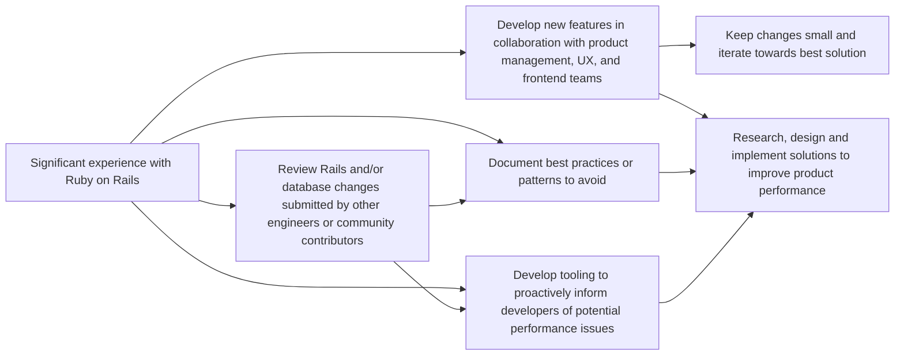
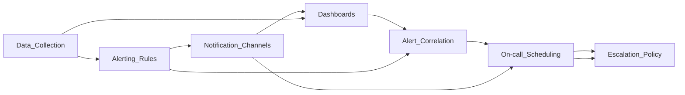
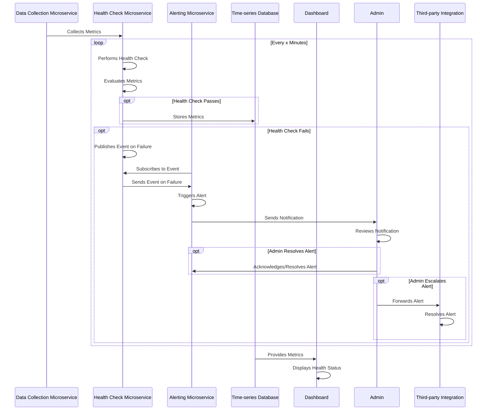
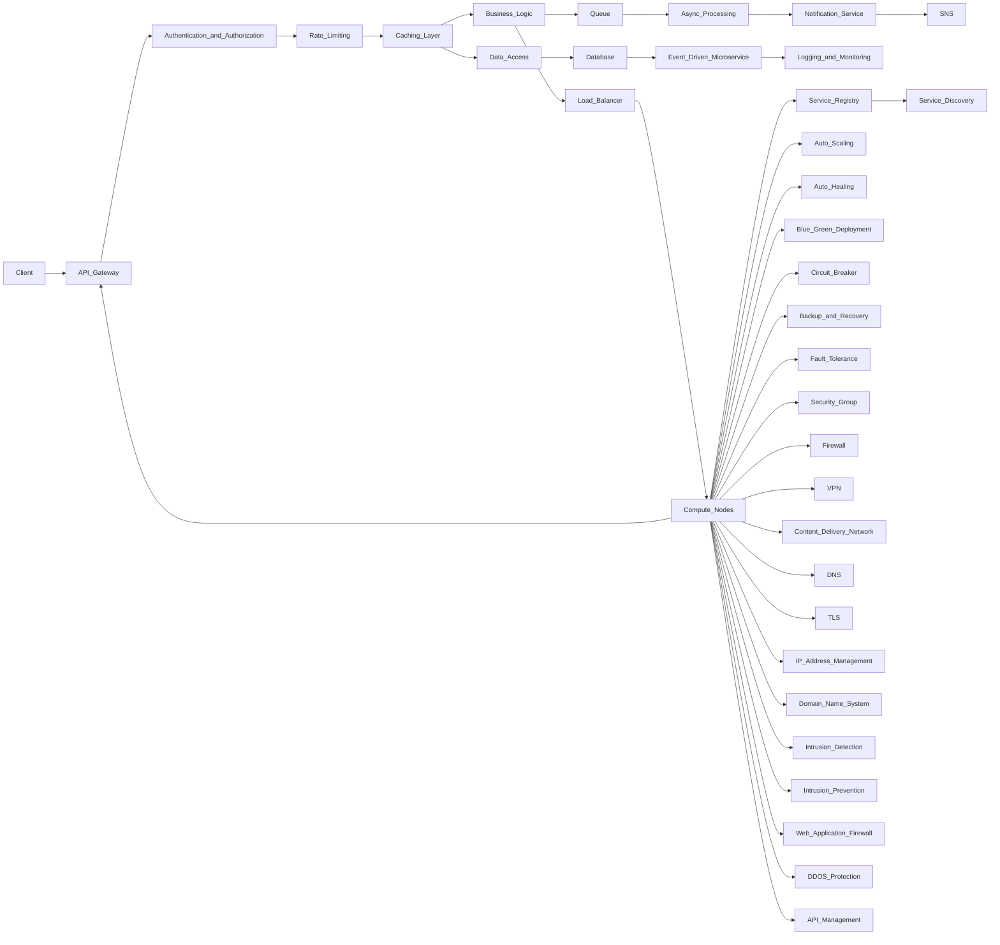

# programming-notes

## Gitlab Diagrams:

- Gitlab Guide

- Major Component Interaction Gitlab

- Gitlab Sequence Diagram

- Gitlab Alertmanager Sequence Diagram

## System Design Diagrams

- Alerting & Monitoring System

- System Design General Template

[Byte Byte Go PDF](https://bytebyte-go.s3.amazonaws.com/ByteByteGo_LinkedIn_PDF.pdf)
